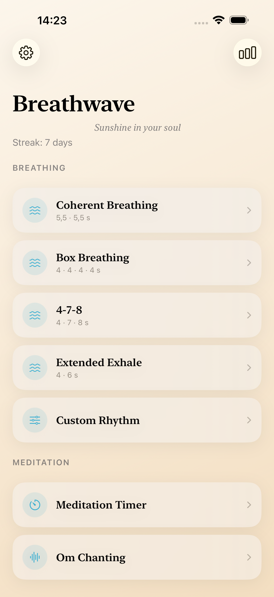
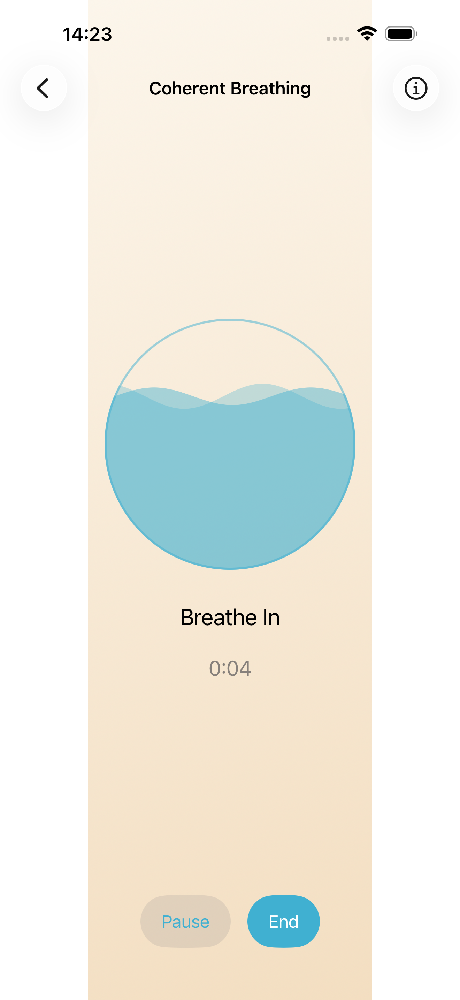
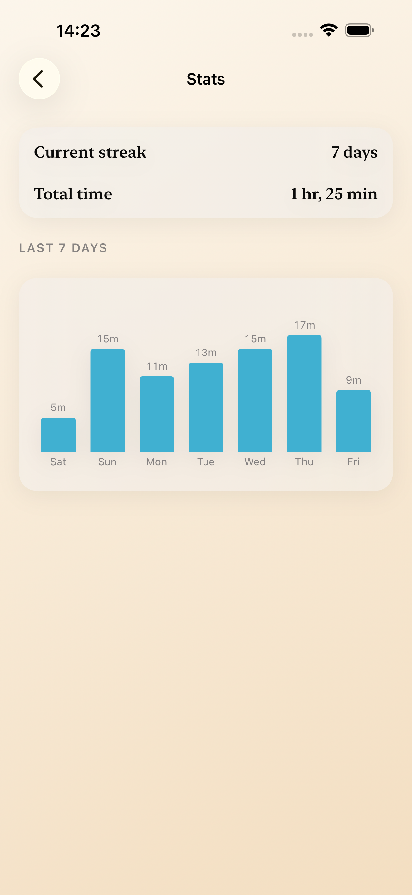
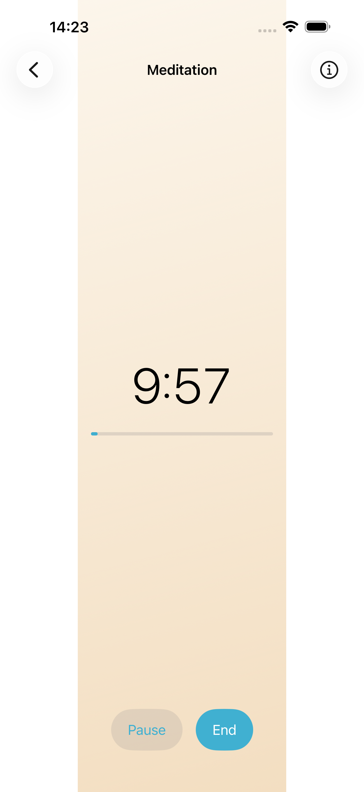

# Breathwave

A minimalist iOS app for guided breathing and quiet meditation. Open it, breathe, feel better.

**Free forever. No ads, no subscriptions, no tracking — it does not even connect to the internet.**

<p>
  
  
  
  
</p>

## Features

- **Breathing exercises** — coherent breathing (5.5 s), box breathing 4-4-4-4, 4-7-8, extended exhale, plus a fully custom rhythm with saved presets
- **Om training** — lengthen your exhale guided by a warm drone
- **Meditation timer** — opening and closing gong, optional interval bells, ambient sound
- **Synthesized soundscapes** — ocean surf and gentle breeze are generated in realtime, no loops; breathing-bell recordings; everything can be turned off independently
- **Haptics** — feel the rhythm with the screen off; sessions keep running in the background
- **Progress** — streak and weekly minutes, stored only on your device
- **Apple Health** — optional write-only sync as mindful minutes
- Fully localized in English and Czech

## The story

Breathwave was vibecoded — built by [Jakub Žemlička](https://jakubzemlicka.cz) together with his AI agent (Claude Code). No team of developers, no investors, just curiosity and many calm breaths. The entire app — architecture, audio synthesis, tests, even this README — was written through human-AI collaboration.

Interested in an app or an AI assistant like this for your business? Visit [jakubzemlicka.cz](https://jakubzemlicka.cz).

## Ideas and requests

Have an idea, found a bug, or is something missing? [Open an issue](../../issues) — Breathwave is built in the open and user ideas shape what comes next.

## Tech notes

- Swift 6, SwiftUI, iOS 17+, **zero external dependencies**
- All breathing sounds are synthesized in realtime with `AVAudioSourceNode` (filtered brown noise, band-passed air, additive drone) — tiny binary, no licensing risk
- Drift-free session timing from `CFAbsoluteTimeGetCurrent()`, never accumulated timer ticks
- `BreathingEngine` is a pure, injectable-clock state machine covered by unit tests
- Persistence is plain JSON in Documents — no database
- Privacy: [privacy policy](docs/privacy/index.html), App Store label "Data Not Collected"

### Building

```bash
xcodebuild -scheme Breathwave -destination 'platform=iOS Simulator,name=iPhone 17' build
xcodebuild -scheme Breathwave -destination 'platform=iOS Simulator,name=iPhone 17' test
```

## License

Source-available for learning and inspiration. All rights reserved — please do not republish this app or derivatives on the App Store.
